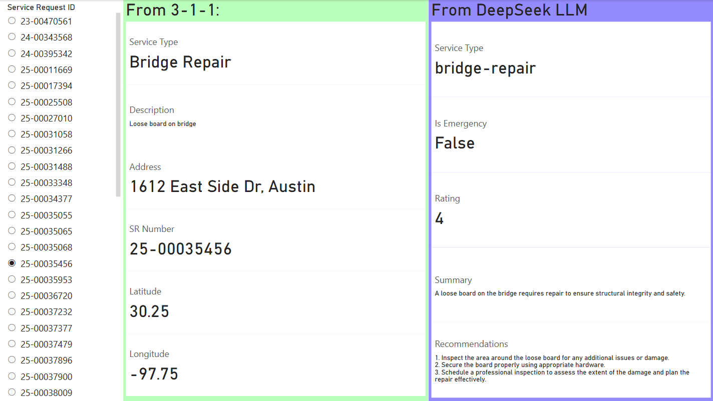

# Augmenting Austin 3-1-1 Data Using LLMs

The goal of this project is to help Austin prioritize and handle incoming 3-1-1 service requests.

## Data Extraction

Currently, this repo downloads a sample of 3-1-1 data from [Austin's Open 3-1-1 site](https://311.austintexas.gov/) and stores
the results in a csv file called `data/311_data_sample.csv`. It can be downloaded with the `311_data_extraction.py` python
script which does require an API key. One can be requested from [the Open 3-1-1 site](https://311.austintexas.gov/open311/app_requests/new).
It extracts 10 samples of each service type described in `config.py`. These names and descriptions are also fed into the LLM.

***

## LLM

The `llm` directory stores the `311_data_augment.py` script which uses [DSPy](https://dspy.ai/) to interact with the LLM.
It is configured by default to run [DeepSeek r1: 7b](https://ollama.com/library/deepseek-r1:7b) locally, however you could
change this to a cloud hosted or whatever other text-based LLM hosted on [ollama](https://ollama.com/).

Running `311_data_augment.py` will run 50 random examples provided in `311_data_sample.csv` through the LLM's prompt and 
will output the results as another csv file called `test_results.csv`.

### Prompt

```
You are an assistant with the City of Austin's Transportation Public Works Department. We receive several service requests
from the public, and we need your help prioritizing them and providing further context. You will help us find service
requests that are not assigned to the correct department to save us time and money.

Background on city terms:
- A traffic signal (or traffic light) is a signaling devices at intersections which direct traffic using colored lights.
- A sign is usually attached to a pole and along the side of the road (such as a STOP sign) these are different than traffic signals

Rules:
- Always use a professional tone suitable for the workplace.
- If there is not enough context provided to confidently classify the service_type then keep the original.
- Only flag service requests as emergencies if they are a true immediate impact to public safety
- Rate a typical service request as 5, a low priority as 0, emergencies should always be a 10.

Your tasks:
1. Check the selected service_type and compare it to all possible service_types to see if the correct one was selected.
2. Check if this service request should be flagged as an emergency that poses a threat to the public
3. Provide a short summary of the request.
4. Provide recommendations for the staff who will address this service request on what to do next.
5. A score from 0 to 10 rating the priority of this service request, based on its potential impact to the community.
```

### LLM Outputs
- `service_type_output (str)`: The appropriate `service_type` for this service request
- `is_emergency (bool)`: Does this service request pose a threat to the public and needs to be addressed immediately?
- `summary (str)`: Summary of the service request.
- `recommendations (str)`: Recommendations for the city's staff to address this service request.
- `rating (int)`: A score from 0 to 10 rating the priority of this service request, based on its potential impact to the community

***

## Power BI

Stored in the `Power BI` directory is a simple Power BI project file that visualizes the output of the LLM.



***

## Future Work/Issues

- Clean up outputs of the model so that more consistently outputs the right format for each output.
- 3-1-1 data frequently comes with images. It would be good to use some sort of multimodal model like Llava to add the image descriptions.
- Turning this into a production-level system that would check for new 3-1-1 requests and run the LLM in real time.
- Few-shot prompting would be cool to take a look at. We would need some examples from humans or some hand-picked good examples from the LLM to do this, though.
- Optimizing the prompt and examples with [DSPy's built-in optimizer](https://dspy.ai/learn/optimization/optimizers/)
